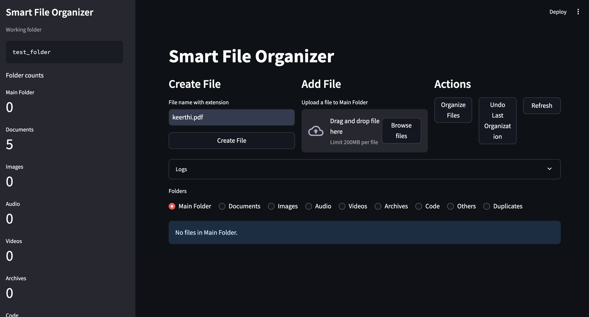
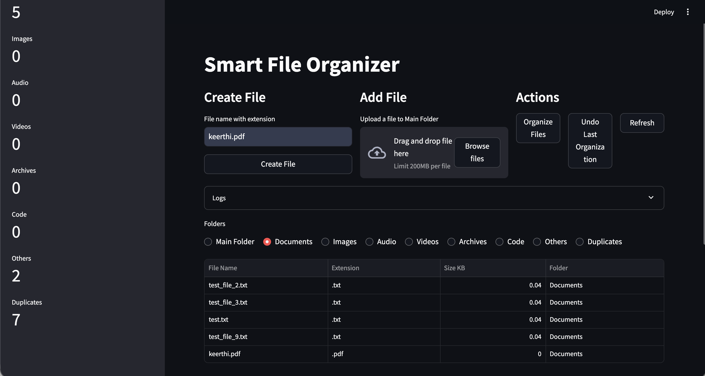
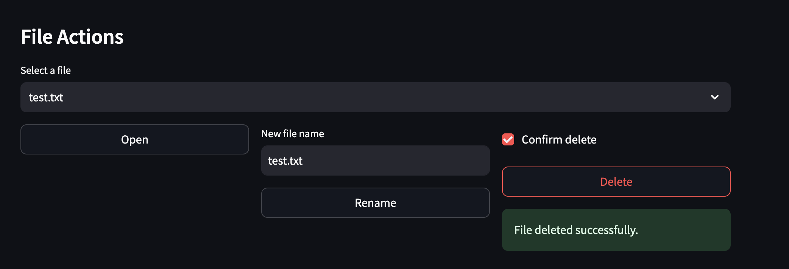

# Smart File Organizer

Smart File Organizer is a Python + Streamlit based file management dashboard that helps keep folders clean and organized. It allows users to create files, add/import files, organize them automatically by file type, browse folders, and manage files using a simple dashboard interface.

The project also includes undo support, duplicate handling, logging, and Watchdog-based real-time folder monitoring.

---

## Features

- Create new files
- Upload/add files into the main folder
- Organize files automatically by extension/type
- Folder-wise browsing and management
- Open files using system default applications
- Rename files
- Delete files safely
- Undo the last organization action
- Duplicate file handling
- Logs panel
- Watchdog-based real-time folder monitoring

---

## Folder Categories

Files are organized into:

- Documents
- Images
- Audio
- Videos
- Archives
- Code
- Others
- Duplicates

---

## Tech Stack

- Python
- Streamlit
- Pandas
- Watchdog

---

## How to Run

Install dependencies:

```bash
pip install -r requirements.txt
```

Run the dashboard:

```bash
streamlit run streamlit_app.py
```

Optional: Run the Watchdog monitoring module separately:

```bash
python watcher.py
```

---

## Project Structure

```text
smart-file-organizer/
├── streamlit_app.py
├── main.py
├── undo.py
├── watcher.py
├── requirements.txt
├── README.md
├── .gitignore
├── config/
├── organizer/
├── logs/
├── data/
├── screenshots/
└── test_folder/
```

---

## Use Case

- Add/import files into one folder
- Organize them automatically into category folders
- Browse organized folders using the dashboard
- Open, rename, or delete files when needed
- Undo the last organization if required

---

## Screenshots

### Dashboard



### Organized Files



### File Actions



---

## Future Improvements

- Multiple undo history support
- Custom organization rules
- Bulk file actions
- Search and filter support
- Drag-and-drop file management

---

